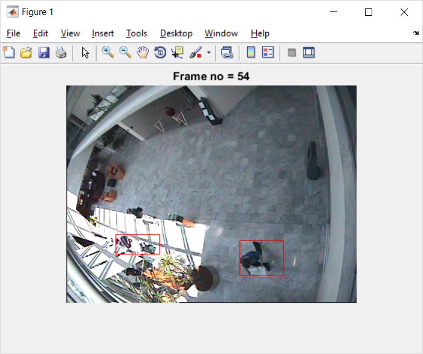
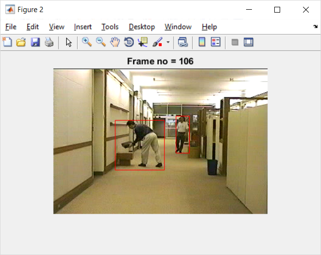
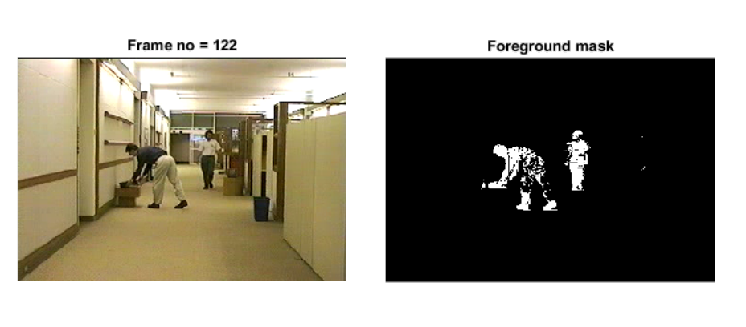

# Moving Object Detection using GMM / DWT

Motion Detection in static background using Gaussian Mixture Model and Discrete Wavelet Transform.

The code has 4 main files.

1. main_dwt.m : DWT based motion detection on Video file. 
2. main_dwt_live.m : Real time motion detection using DWT. 
3. main_gmm.m : GMM based motion detection on Video File.
4. main_gmm_live.m : Real time motion detection using GMM.

Additional code for motion detection are provided in multithresholding folder.

following are the screenshot of result

